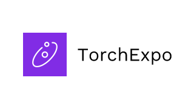
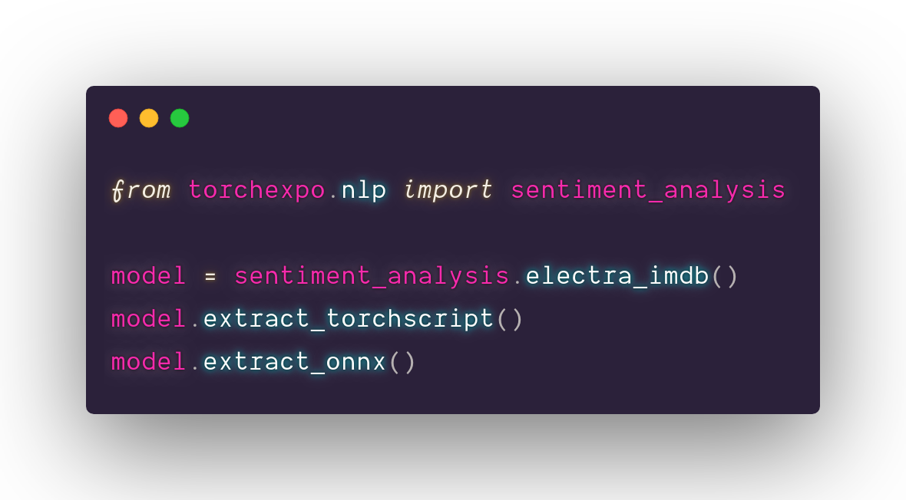

<h1 align="center">
 
</h1>

<p align="center">
 <a href="https://pypi.org/project/torchexpo"></a> 
 <a href="https://circleci.com/gh/torchexpo/torchexpo"></a>
 <a href="https://torchexpo.readthedocs.io/en/latest/?badge=latest"></a> 
 <a href="LICENSE"></a>
 
</p>

TorchExpo is a collection of models and extensions for mobile deployment in PyTorch

- [Installation](#installation)
  - [Binaries](#binaries)
  - [From Source](#from-source)
  - [Building the Documentation](#building-the-documentation)
- [Getting Started](#getting-started)
- [Contributing](#contributing)
- [License](#license)

<p align="center">
  
</p>

## Installation

### Binaries

Commands to install from binaries via Conda or pip wheels are as follows:  
**pip**
```bash
pip install torchexpo
```

**Conda**  
*Coming Soon*

### From Source

```bash
git clone --recursive https://github.com/torchexpo/torchexpo
cd torchexpo
python setup.py install
```

### Building the Documentation

To build documentation in various formats, you will need [Sphinx](http://www.sphinx-doc.org) and the
readthedocs theme.

```bash
cd docs/
pip install -r requirements.txt
```
You can then build the documentation by running ``make <format>`` from the
``docs/`` folder. Run ``make`` to get a list of all available output formats.

## Getting Started

- [Examples _(Coming Soon)_]()
- [The API Reference](https://torchexpo.rtfd.io)

## Resources

* [Documentation](https://torchexpo.rtfd.io)
* [TorchExpo Twitter](https://twitter.com/torchexpo)
* [TorchExpo Blog](https://medium.com/torchexpo)
* [TorchExpo YouTube](https://www.youtube.com/channel/UCR76Qj9S9h-gAH9RSnJ6u8g)

## Contributing

We appreciate all contributions. If you are planning to contribute back bug-fixes, please do so
without any further discussion.

If you plan to contribute new features, utility functions or any application upgrades, please first
open an issue and discuss the feature with us. Sending a PR without discussion might end up
resulting in a rejected PR, because we might be taking the project in a different direction
than you might be aware of.

Please refer our [Contribution Guide](CONTRIBUTING.md) for more details.

## License

This project is licensed under Apache-2.0 as given in [LICENSE](LICENSE) file.